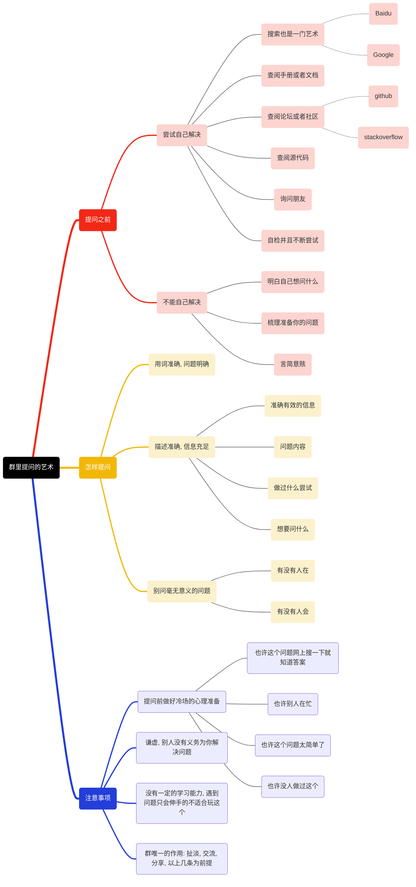

点击返回[🔗我的博客文章目录](https://percheung.github.io/#/toc)

* 目录
{:toc}

# Typora绘制思维导图

## 1.我要绘制的思维导图是什么样的？

在我的上一篇博客[群里提问的艺术](https://percheung.github.io/blog/群里提问的艺术)里，我画了这样一个思维导图。

> 本文的目标就是，用typora直接复现这个思维导图。

## 2.Typora绘制思维导图的思路

我们观察一下，其实思维导图就是树状结构的数据嘛，作为程序员，拿语言写树状结构的数据是很平常的事情。而且写代码可比画图省事多了，查阅资料可以知道，有一种`mermaid`语法，就是做这件事情的，支持 UML，甘特图，流程图等。

**重要的是，Typora就支持写mermaid。**

## 3.开始绘制

### 3.1 绘制前的准备工作（mermaid语法手册）

> 掌握原理是做事的第一步

Mermaid 是一种用于描述图表、流程图和时序图等的文本驱动的图形语言。它使用简洁的文本语法来定义图表结构，然后将其转换为可视化图形。

当使用Mermaid语法时，你可以使用一些关键字来定义不同类型的图形。下面是一些常用的关键字及其作用：

1. `[*]`：用于表示一个节点的形状为圆形，表示该节点是一个起始或结束节点。
2. `<|--`：用于表示继承关系，其中左侧的类或接口是右侧类或接口的子类或实现类。
3. `+`：在类图中，表示公共（public）属性或方法。
4. `-`：在类图中，表示私有（private）属性或方法。
5. `pie`：在流程图中，表示一个饼图节点，通常用于表示一个决策或选项的分支。
6. `graph`：用于指定图的方向。常见的方向有：`LR`（从左到右）、`RL`（从右到左）、`TB`（从上到下）、`BT`（从下到上）。
7. `||`：线上的文字。
8. `[]`：方形。
9. `{}`：菱形条件节点。
10. `()`：圆角矩形。
11. `(())`：圆形。
12. `>]`：不对称节点。
13. `---`：无箭头的实线。
14. `-.-`：无箭头的虚线。
15. `-.->`：有箭头的虚线。
16. `-->`：有箭头的实线。
17. `style`：用于定义节点和连接线的样式。
18. `fill`：设置节点或连接线的填充颜色。
19. `stroke`：设置节点或连接线的边框颜色。
20. `stroke-width`：设置节点或连接线的边框宽度。
21. `stroke-dasharray`：设置节点或连接线的边框为虚线样式，通过指定虚线段的长度。
22. `linkStyle`：用于设置连接线的样式。
23. `stroke`：设置连接线的颜色。
24. `stroke-width`：设置连接线的宽度。
25. `sequenceDiagram`：用于创建序列图。序列图展示了不同参与者之间的交互顺序，以及消息的发送和接收顺序。
26.  `classDiagram`：用于创建类图。类图展示了类、接口、属性和方法之间的关系，用于描述面向对象的结构。
27.  `participant`：在序列图中，用于定义参与者或对象。
28.  `class`：在类图中，用于定义类或接口。
29.  `extends` 或 `<<extends>>`：在类图中，用于定义类的继承关系。
29.  `%%`：可以写行注释。

> 关于这些语法具体表现出来的简单图，可以参考下面这两篇博客，作者在博客里已经写得非常好了，里面有直接写语言后出来的图的样子，我就不重复造轮子了。

**1. 来自知乎，[使用 Typora 画图（类图、流程图、时序图）](https://zhuanlan.zhihu.com/p/172635547)**。

**2.来自菜鸟教程，[typora 画流程图、时序图(顺序图)、甘特图](https://www.runoob.com/note/47651)。**

**3.来自腾讯云，[mermaid 语法](https://cloud.tencent.com/developer/article/1334691)**。

### 3.2 绘制思维导图

> 下面直接写代码来讲解。

```mermaid
%% graph定义了这是流程图，方向从左到右
graph LR

%% 然后别急着画图，我们把每个节点定义成变量。（写代码是一门艺术，一定要写的逻辑清楚，我用o表示根节点，后面按层级的规律给它编码）
o(群里提问的艺术)
o1(提问之前)
o11(尝试自己解决)
o111(搜索也是一门艺术)
o1111(Baidu)
o1112(Google)
o112(查阅手册或者文档)
o113(查阅论坛或者社区)
o1131(github)
o1132(stackoverflow)
o114(查阅源代码)
o115(询问朋友)
o116(自检并且不断尝试)
o12(不能自己解决)
o121(明白自己想问什么)
o122(梳理准备你的问题)
o123(言简意赅)
o2(怎样提问)
o21(用词准确, 问题明确)
o22(描述准确, 信息充足)
o221(准确有效的信息)
o222(问题内容)
o223(做过什么尝试)
o224(想要问什么)
o23(别问毫无意义的问题)
o231(有没有人在)
o232(有没有人会)
o3(注意事项)
o31(提问前做好冷场的心理准备)
o311(也许这个问题网上搜一下就知道答案)
o312(也许别人在忙)
o313(也许这个问题太简单了)
o314(也许没人做过这个)
o32(谦虚, 别人没有义务为你解决问题)
o33(没有一定的学习能力, 遇到问题只会伸手的不适合玩这个)
o34(群唯一的作用: 扯淡, 交流, 分享, 以上几条为前提)

%% 定义变量后再开始连接节点。
o --- o1
o --- o2
o --- o3
o1 --- o11
o1 --- o12
o2 --- o21
o2 --- o22
o2 --- o23
o3 --- o31
o3 --- o32
o3 --- o33
o3 --- o34
o11 --- o111
o111 -.- o1111
o111 -.- o1112
o11 --- o112
o11 --- o113
o113 -.- o1131
o113 -.- o1132
o11 --- o114
o11 --- o115
o11 --- o116
o12 --- o121
o12 --- o122
o12 --- o123
o22 --- o221
o22 --- o222
o22 --- o223
o22 --- o224
o23 --- o231
o23 --- o232
o31 --- o311
o31 --- o312
o31 --- o313
o31 --- o314

%% 到这里连接就写完了，其实这里就足够了，下面是美化样式的方法，精益求精，也可以不求。
%% -------------------------------------------------------------------------
%% 下面开始绘制节点的样式，fill管背景色，stroke管边框，color是字体颜色，有点类似css的语法。
style o fill:black,stroke:black,stroke-width:1px,color:white
style o1 fill:#f22816,stroke:#f22816,stroke-width:1px,color:white
style o2 fill:#f2b807,stroke:#f2b807,stroke-width:1px,color:white
style o3 fill:#233ed9,stroke:#233ed9,stroke-width:1px,color:white
style o11 fill:#fcd4d0,stroke:#fcd4d0,stroke-width:1px
style o12 fill:#fcd4d0,stroke:#fcd4d0,stroke-width:1px
style o111 fill:#fcd4d0,stroke:#fcd4d0,stroke-width:1px
style o112 fill:#fcd4d0,stroke:#fcd4d0,stroke-width:1px
style o113 fill:#fcd4d0,stroke:#fcd4d0,stroke-width:1px
style o114 fill:#fcd4d0,stroke:#fcd4d0,stroke-width:1px
style o115 fill:#fcd4d0,stroke:#fcd4d0,stroke-width:1px
style o116 fill:#fcd4d0,stroke:#fcd4d0,stroke-width:1px
style o121 fill:#fcd4d0,stroke:#fcd4d0,stroke-width:1px
style o122 fill:#fcd4d0,stroke:#fcd4d0,stroke-width:1px
style o123 fill:#fcd4d0,stroke:#fcd4d0,stroke-width:1px
style o1111 fill:#fcd4d0,stroke:#fcd4d0,stroke-width:1px
style o1112 fill:#fcd4d0,stroke:#fcd4d0,stroke-width:1px
style o1131 fill:#fcd4d0,stroke:#fcd4d0,stroke-width:1px
style o1132 fill:#fcd4d0,stroke:#fcd4d0,stroke-width:1px
style o21 fill:#fcf1cd,stroke:#fcf1cd,stroke-width:1px
style o22 fill:#fcf1cd,stroke:#fcf1cd,stroke-width:1px
style o221 fill:#fcf1cd,stroke:#fcf1cd,stroke-width:1px
style o222 fill:#fcf1cd,stroke:#fcf1cd,stroke-width:1px
style o223 fill:#fcf1cd,stroke:#fcf1cd,stroke-width:1px
style o224 fill:#fcf1cd,stroke:#fcf1cd,stroke-width:1px
style o23 fill:#fcf1cd,stroke:#fcf1cd,stroke-width:1px
style o231 fill:#fcf1cd,stroke:#fcf1cd,stroke-width:1px
style o232 fill:#fcf1cd,stroke:#fcf1cd,stroke-width:1px

%% 下面开始绘制线条的样式，以第一个为例子，0代表第一根线，顺序以代码的线出现的位置为准
linkStyle 0 stroke:#f22816,stroke-width:5px;
linkStyle 1 stroke:#f2b807,stroke-width:5px;
linkStyle 2 stroke:#233ed9,stroke-width:5px;
linkStyle 3 stroke:#f22816,stroke-width:3px;
linkStyle 4 stroke:#f22816,stroke-width:3px;
linkStyle 5 stroke:#f2b807,stroke-width:3px;
linkStyle 6 stroke:#f2b807,stroke-width:3px;
linkStyle 7 stroke:#f2b807,stroke-width:3px;
linkStyle 8 stroke:#233ed9,stroke-width:3px;
linkStyle 9 stroke:#233ed9,stroke-width:3px;
linkStyle 10 stroke:#233ed9,stroke-width:3px;
linkStyle 11 stroke:#233ed9,stroke-width:3px;
```

### 3.3 成品

